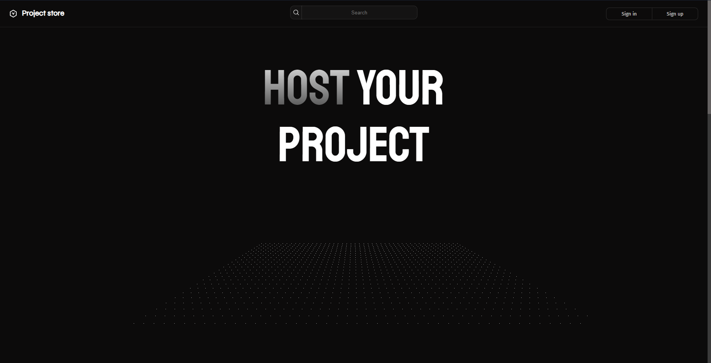

# 🛜 Project store

Software development platform created for education purpose.

[](https://choosealicense.com/licenses/mit/)


## Most important features

- 🔒 Login, registration
- 🪪 Creating user profile
- 🖥️ Creating and managing projects
- 📁 Uploading files to project
- ❔ Creating and managing issues in project
- ✅ Uploading release in project
- ⌨️ Editing project files in web code editor
- 🔎 Search projects, users
- 🌍 Exploring projects
- ✉️ Real time chatting with users
- 🧷 Provide oauth2 login
- 🪱 Reporting errors

## Screenshots




## Tech Stack

**Client:** Sveltekit, Typescript, Scss

**Server:** Spring Boot, Postgresql


## Run Locally

Clone the project

```bash
  git clone https://github.com/Pla9er9/Project-store
```

### Client

Go to the project's app directory

```bash
cd Project-store/app
```

Install dependencies

```bash
npm install
```

Start the server

```bash
npm run dev
```

### Server

- Create `server/src/main/resources/application.properties` you can use options from `application.properties.example` file

- Run postgresql server with options from `application.properties`

- Install maven dependencies

- Run java server

### Environment Variables

To run this project, you will need to create and add the following environment variables to your `app/.env` file

`PUBLIC_API_URL` - server api url fe: http://localhost:8080/api/v1

## License

[MIT](https://choosealicense.com/licenses/mit/)

